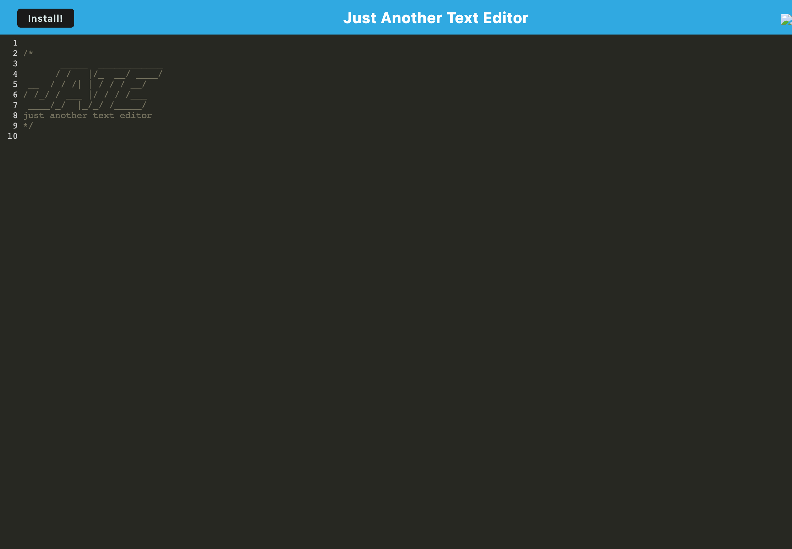

# Text Editor - PWA 

## License
   

   Please click on the badge to view license info.
   

## Description
The app  is a single-page application that meets the PWA criteria. Additionally, it features a number of data persistence techniques that serve as redundancy in case one of the options is not supported by the browser. The applicationn also functions offline.

## Deployed Link
https://text-editor-pwa-ssb.herokuapp.com/

## Table of Contents

- [License](#license)
- [Description](#description)
- [Installation](#installation)
- [Usage](#usage)
- [Visuals](#visuals)
- [Tests](#tests)
- [Contributors](#contributors)
- [Contact](#contact)

## Installation
Click the install button and and you'll have access to the app and it's features!

## Usage
To help a developer create code snippets and notes, even if they don't ahave an internet connection,

## Visuals

## Tests

None

## Contributors

Sherreka S. Burton

## Contact

If you have any questions about this project please contact: Sherreka S. Burton

Github: [ssbbgm](http://github.com/ssbbgm)

Email: ssburto825@gmail.com